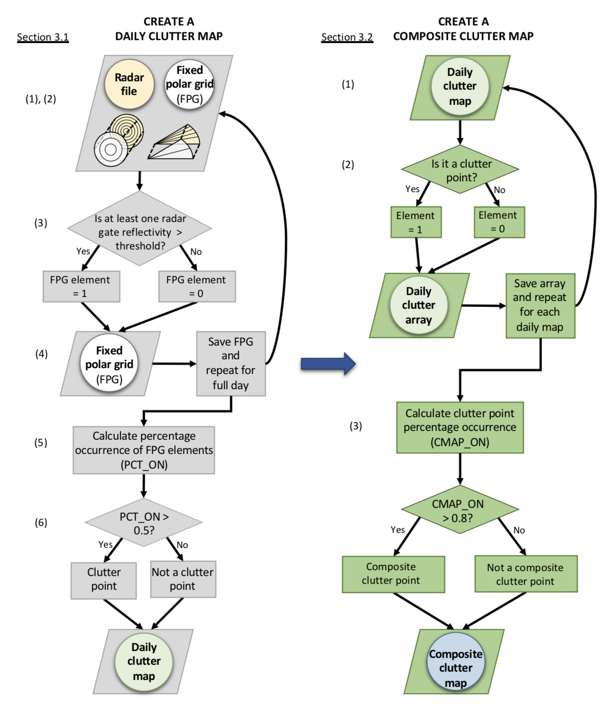
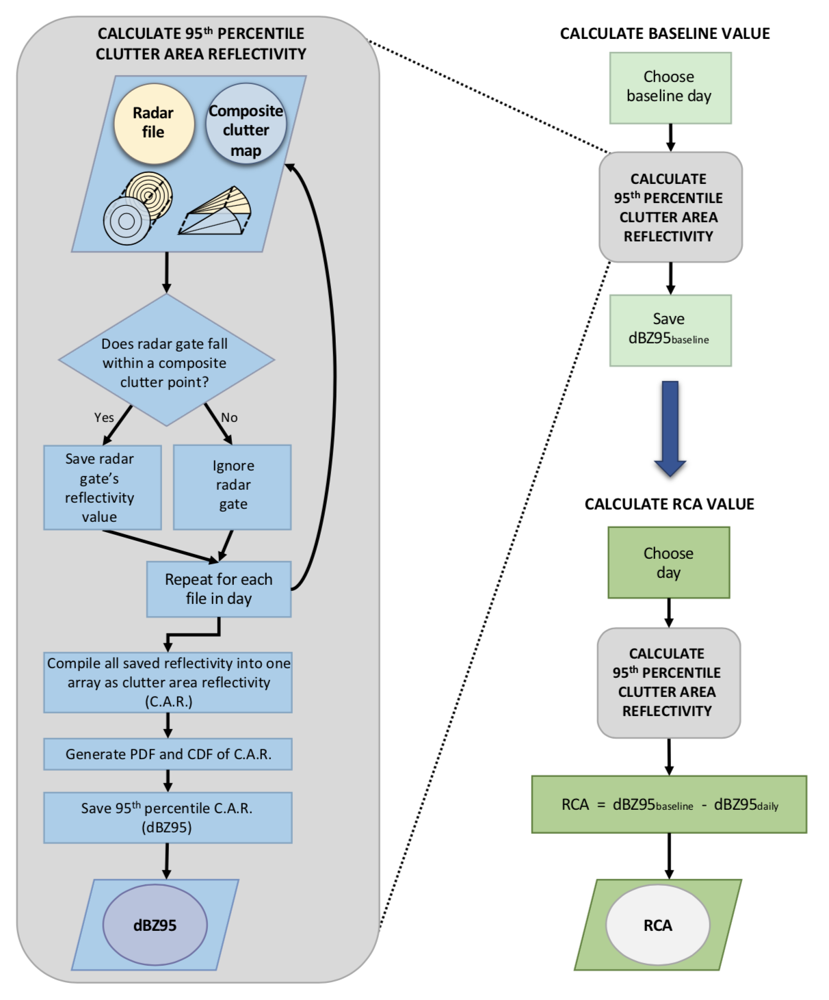

=====================
eRCA for Weather Radar
=====================

This package is an extension of the relative calibration adjusment (RCA) technique developed for the calibration of weather radar. The extension, eRCA, is built to calculate RCA for C-, X-, and Ka-band radars that use both PPI and RHI scans.

Description
===========

eRCA for Weather Radar is an open source Python package to work with weather radar data from C-, X-, and Ka-band frequencies. The package contains code written to accommodate for both plan-position indicator (PPI) and range-height indicator (RHI) scans, adapted from the original methodology and steps outlined in `Silberstein et al. (2008) <https://journals.ametsoc.org/doi/pdf/10.1175/2008JTECHA1063.1>`__ and `Wolff et al. (2015) <https://doi.org/10.1175/JTECH-D-13-00185.1>`__. Resulting daily relative calibration adjustment (RCA) values may be used in a time series to track the calibration and monitor the health of the radar. The RCA tool is not recommended for absolute calibration of a radar. 

Important Links
===============

- Source Code Repository: https://github.com/josephhardinee/rca
- Documentation: https://josephhardinee.github.io/rca
- Examples: https://josephhardinee.github.io/rca/examples.html
- Issues: https://github.com/josephhardinee/rca/issues 

Citing
======

Install
=======

There are two methods for installing RCA for Weather Radar:

From Source:
------------

From the terminal, in your desired directory::

    git clone http://github.com/josephhardinee/rca
    cd rca
    python setup.py install

Using Anaconda Python Distribution:
-----------------------------------

Simply type::

    conda install -c conda-forge rca

This installs the latest package and dependencies.

Usage
=====

TODO: Please refer to the publication

Figures 1 and 2 summarize the steps for RCA calculation and represent the workflow and code structure of RCA for Weather Radar.

   
   This is the caption for Figure 1 (not labeled?)

   This is the caption for Figure 2 (is it actually labeled?) 

Contributing
============

Note
====

