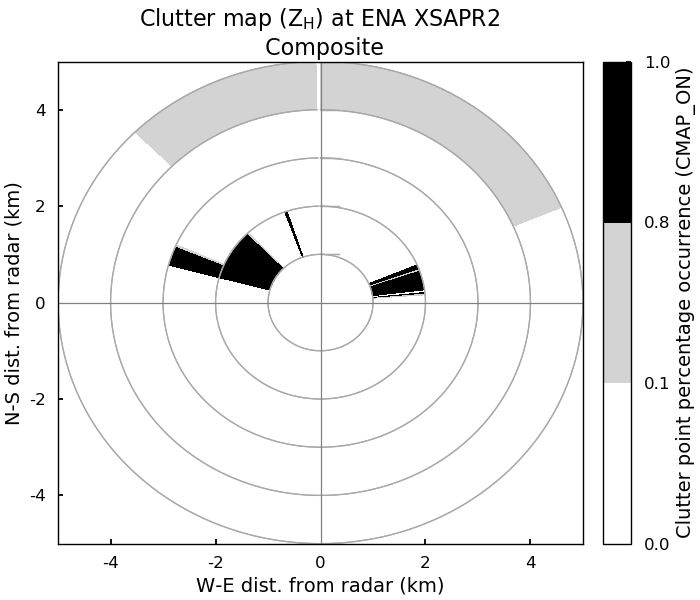

Plot a clutter map
------------------

A simple plotting routine for visualizing the clutter map. You'll need to specify several paramters for the routine:

+ Path to clutter map netCDF
+ Path to output directory for plots
+ Scan type (i.e. PPI, RHI)
+ Map type (i.e. daily or composite)
+ Polarization (i.e. horizontal or dual)
+ Maximum range to plot in kilometers
+ Site abbreviation
+ Instrument name

The routine can plot maps of both PPI and RHI scan types, as well as both daily and composite clutter maps. 

.. code-block:: python
   
   # import commands
   import matplotlib.pyplot as plt
   from .plot.plot_clutter_map import plot_clutter_map

   # specify all parameters
   clutter_map_netcdf = '/__my_path_to__/__my_clutter_map.nc__'
   output_directory = '__my_path_to__/__my_figure_output_directory__/'
   scan_type = 'ppi'
   map_type = 'composite'
   polarization = 'horizontal'
   max_range = 5
   site = 'ena'
   inst = 'xsapr2'

   plot_clutter_map(clutter_map_netcdf,
                    output_directory,
                    scan_type,
                    map_type,
                    polarization,
                    max_range,
                    site,
                    inst
                    )

The plot generated is found in the specified output directory and for the parameters listed in the example, will look like this:

